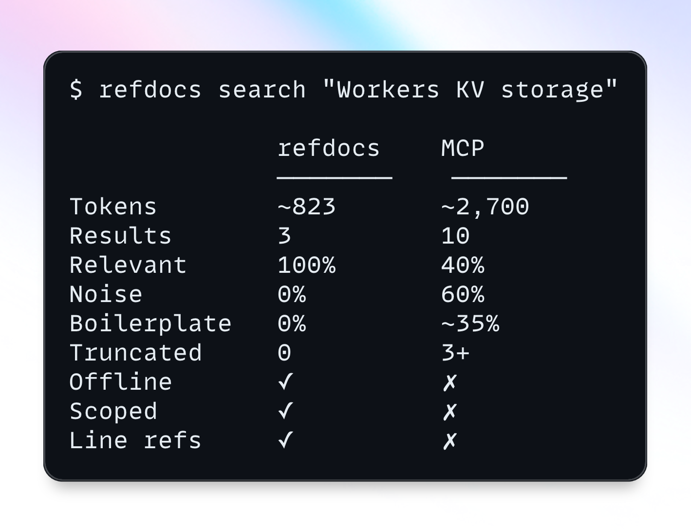

# refdocs



[](https://github.com/dynamik-dev/refdoc-cli/actions/workflows/test.yml)
[](https://github.com/dynamik-dev/refdoc-cli/actions/workflows/publish.yml)
[](https://www.npmjs.com/package/@dynamik-dev/refdocs)

Index your markdown docs. Search them fast. Get back only what matters.

Built for LLM coding agents that need token-conscious access to project documentation — no network calls, no API keys, no MCP servers. Just a local CLI and a JSON index file.

## Install

```bash
npm install -g @dynamik-dev/refdocs
```

## Quick start

```bash
# Initialize config in your project
cd your-project
refdocs init

# Add docs from anywhere
refdocs add ./docs                                        # local directory
refdocs add https://github.com/laravel/docs --branch 11.x # GitHub repo

# Search
refdocs search "database connections"
```

Output:

```
# [1] config/database.md:12-34
# Configuration > Database > Connections

Connection pooling is configured via the `pool` key in your
database config. Each connection type supports `min`, `max`,
and `idle_timeout` options...

---

# [2] guides/troubleshooting.md:88-104
# Troubleshooting > Database > Connection Refused

If you see "ECONNREFUSED", check that your database server
is running and the host/port in your config matches...
```

refdocs chunks markdown at heading boundaries into 100-800 token pieces, indexes them with fuzzy search, and returns only the relevant chunks — not entire files.

## Commands

```bash
# Setup
refdocs init                              # create .refdocs.json with defaults
refdocs init -g                           # create global config at ~/.refdocs/

# Add sources
refdocs add ./docs                        # local directory
refdocs add https://github.com/org/repo   # GitHub repo (downloads markdown files)
refdocs add <source> -g                   # add to global ~/.refdocs/ store

# Search
refdocs search "authentication"
refdocs search "config" -n 5              # top 5 results
refdocs search "api" -f "api/**/*.md"     # filter by file glob
refdocs search "hooks" --json             # structured output
refdocs search "auth" --raw               # body only, for piping
refdocs eval docs/eval-suite.example.json # baseline vs reranked token-efficiency report
npm run eval:run                          # index + eval JSON report to eval-reports/

# Manage
refdocs index                             # rebuild the search index
refdocs list                              # files and chunk counts
refdocs info "api/auth.md"               # chunks in a specific file
refdocs update                            # re-pull all tracked sources
refdocs remove ref-docs/laravel           # remove a path from config
```

## How it works

1. **Index** — parses each `.md` file into an AST, splits at h1/h2/h3 boundaries, merges small sections, splits large ones at paragraph breaks. Each chunk keeps its full heading breadcrumb (`Config > Database > Connections`).

2. **Search** — fuzzy matching (20% edit tolerance) with prefix search and field boosting. Titles weighted 2x, headings 1.5x, body 1x. A lightweight reranker then improves multi-intent coverage using exact symbol boosts, diversity penalties, and token-efficiency weighting.

3. **Output** — human-readable by default, `--json` for structured consumption, `--raw` for piping. Each result includes source file, line range, and heading trail.

## Evaluation harness

Use `refdocs eval <suite.json>` to compare baseline TF-IDF ranking against reranked retrieval quality.

- Tracks full-facet coverage rate
- Tracks tokens to first useful hit
- Tracks tokens to full query coverage
- Emits win/tie/loss by query so ranking changes are measurable

Example suite template: `docs/eval-suite.example.json`

For repeatable runs with timestamped outputs:

```bash
npm run eval:run
npm run eval:run -- --suite docs/eval-suite.example.json --results 8
```

This writes reports to `eval-reports/<suite>-<UTC timestamp>.json` and updates a stable symlink:
`eval-reports/<suite>-latest.json`.

## Adding sources

`refdocs add` supports two source types:

| Source | Behavior |
|--------|----------|
| Local path (`./docs`) | Adds directory to config |
| GitHub URL | Downloads `.md` files from the repo tarball |

GitHub sources are tracked in `.refdocs.json` and can be re-pulled with `refdocs update`.

## Global docs

Use `-g` / `--global` to store docs in `~/.refdocs/` — useful for references you want across all projects.

```bash
refdocs init -g
refdocs add https://github.com/org/docs -g
```

Search automatically merges results from both local and global indexes. Global results are labeled `[global]` in output.

## Configuration

`.refdocs.json` at project root:

```json
{
  "paths": ["docs"],
  "index": ".refdocs-index.json",
  "chunkMaxTokens": 800,
  "chunkMinTokens": 100,
  "boostFields": { "title": 2, "headings": 1.5, "body": 1 }
}
```

All fields optional. See [Configuration](docs/configuration.md) for details.

## Documentation

- [Getting Started](docs/getting-started.md) — installation, quick start, and overview
- [CLI Reference](docs/cli-reference.md) — commands, flags, output formats, and exit codes
- [Configuration](docs/configuration.md) — `.refdocs.json` options with defaults and examples
- [Chunking](docs/chunking.md) — the 3-pass splitting algorithm and chunk structure
- [Search](docs/search.md) — fuzzy matching, boosting, scoring, and index persistence

## Tech

| Dependency | Role |
|------------|------|
| [MiniSearch](https://github.com/lucaong/minisearch) | Full-text fuzzy search (~7kb, pure JS) |
| [Commander](https://github.com/tj/commander.js) | CLI framework |
| [mdast-util-from-markdown](https://github.com/syntax-tree/mdast-util-from-markdown) | Markdown AST parsing |
| [picomatch](https://github.com/micromatch/picomatch) | Glob pattern matching |
| [tar-stream](https://github.com/mafintosh/tar-stream) | Tarball extraction for GitHub sources |

Zero external services. Works offline, in containers, on planes.
